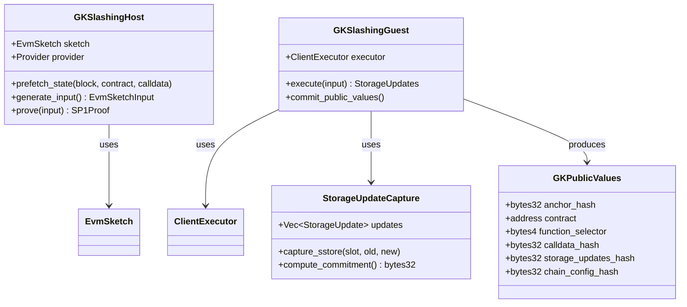

# Technical Specification: SP1/revm Implementation for Gas Killer Slashing

**Version:** 1.0
**Status:** Draft
**Last Updated:** November 28, 2025
**Parent Spec:** [GAS_KILLER_SLASHING_SPEC.md](./GAS_KILLER_SLASHING_SPEC.md)

## 1. Background

### Problem Statement

The [Gas Killer Slashing Spec](./GAS_KILLER_SLASHING_SPEC.md) defines the requirements for proving that operators signed incorrect storage slot updates. This implementation spec details how to use SP1 zkVM with revm to generate ZK proofs of EVM execution for the slashing mechanism.

### Context / History

| Reference | Description |
|-----------|-------------|
| [sp1-contract-call](https://github.com/succinctlabs/sp1-contract-call) | Succinct's library for ZK-proven EVM contract execution |
| [SP1 Documentation](https://docs.succinct.xyz) | Official SP1 zkVM documentation |
| [revm](https://github.com/bluealloy/revm) | Rust EVM implementation used by sp1-contract-call |
| Parent Spec | Gas Killer Slashing Specification |

### Key Components from sp1-contract-call

The sp1-contract-call library provides two main crates:

| Crate | Purpose |
|-------|---------|
| `sp1-cc-host-executor` | Host-side execution and state prefetching |
| `sp1-cc-client-executor` | Guest program execution inside SP1 zkVM |

**Core Types:**

- `EvmSketch` - Host-side executor for prefetching state
- `EvmSketchInput` - Serializable input for the guest program
- `ClientExecutor` - Guest-side executor for zkVM execution
- `ContractInput` - Specification for contract calls
- `ContractPublicValues` - Output values committed to the proof

## 2. Motivation

### Goals

**Goal 1: Prove Original Function Execution**

Generate a ZK proof that executing the original function with given inputs produces specific storage slot updates.

**Goal 2: Deterministic Results**

Ensure that operators, slashers, and verifiers all compute identical storage updates for the same inputs.

**Goal 3: Integration with Relic Protocol**

Use Relic Protocol proofs as trusted anchors for block state, avoiding custom state proof implementation.

**Goal 4: On-Chain Verifiability**

Produce proofs verifiable by SP1's on-chain verifier contract (~275k gas).

## 3. Scope and Approaches

### In Scope

- SP1 guest program for executing original functions
- Host program for prefetching state from Ethereum
- Storage update extraction and commitment
- Integration with Relic Protocol anchors
- On-chain verification contract interface

### Out of Scope

- Relic Protocol integration details (separate implementation)
- Slashing contract implementation (covered in parent spec)
- Operator signature verification (existing GK infrastructure)

## 4. Architecture

### 4.1 System Components



### 4.2 Execution Flow

```mermaid
sequenceDiagram
    participant Slasher
    participant Host as GKSlashingHost
    participant SP1Prover
    participant Guest as GKSlashingGuest
    participant OnChain as SlashingContract

    Slasher ->> Host: prefetch_state(block, contract, calldata)
    Host ->> Host: EvmSketch.call() to warm cache
    Host ->> Host: EvmSketch.finalize() → EvmSketchInput

    Slasher ->> SP1Prover: prove(guest_elf, input)

    Note over SP1Prover,Guest: Inside SP1 zkVM
    SP1Prover ->> Guest: execute(EvmSketchInput)
    Guest ->> Guest: ClientExecutor.execute()
    Guest ->> Guest: capture storage updates
    Guest ->> Guest: compute_commitment()
    Guest ->> Guest: commit GKPublicValues
    SP1Prover -->> Slasher: (proof, public_values)

    Slasher ->> OnChain: submitChallenge(proof, public_values)
    OnChain ->> OnChain: verify SP1 proof
    OnChain ->> OnChain: compare storage_updates_hash
```



## 5. Implementation Details

### 5.1 Guest Program

The guest program executes inside SP1 zkVM and produces a commitment to the storage updates.

```rust
#![no_main]
sp1_zkvm::entrypoint!(main);

use alloy_primitives::{Address, Bytes, B256, U256};
use alloy_sol_macro::sol;
use alloy_sol_types::SolValue;
use sp1_cc_client_executor::{io::EvmSketchInput, ClientExecutor, ContractInput};

sol! {
    /// Public values committed by the GK slashing guest program
    struct GKPublicValues {
        /// Block anchor hash (from Relic Protocol)
        bytes32 anchorHash;
        /// Target contract address
        address contractAddress;
        /// Original function selector
        bytes4 functionSelector;
        /// Hash of calldata
        bytes32 calldataHash;
        /// Hash of storage updates produced by execution
        bytes32 storageUpdatesHash;
        /// Chain config hash (chain_id + hardfork)
        bytes32 chainConfigHash;
    }

    /// Storage update record
    struct StorageUpdate {
        bytes32 slot;
        bytes32 oldValue;
        bytes32 newValue;
    }
}

pub fn main() {
    // Read inputs from SP1 stdin
    let state_sketch_bytes = sp1_zkvm::io::read::<Vec<u8>>();
    let state_sketch = bincode::deserialize::<EvmSketchInput>(&state_sketch_bytes).unwrap();

    let contract_address = sp1_zkvm::io::read::<Address>();
    let function_selector = sp1_zkvm::io::read::<[u8; 4]>();
    let calldata = sp1_zkvm::io::read::<Bytes>();

    // Initialize the client executor
    let executor = ClientExecutor::eth(&state_sketch).unwrap();

    // Execute the original function
    let input = ContractInput {
        contract_address,
        caller_address: Address::ZERO, // Caller doesn't affect storage writes
        calldata: sp1_cc_client_executor::ContractCalldata::Call(calldata.clone()),
    };

    let result = executor.execute(input).unwrap();

    // Extract storage updates from execution
    // Note: This requires extending ClientExecutor to capture SSTORE operations
    let storage_updates = extract_storage_updates(&executor);
    let storage_updates_hash = compute_storage_hash(&storage_updates);

    // Compute calldata hash
    let calldata_hash = alloy_primitives::keccak256(&calldata);

    // Build public values
    let public_values = GKPublicValues {
        anchorHash: executor.anchor.hash,
        contractAddress: contract_address,
        functionSelector: function_selector.into(),
        calldataHash: calldata_hash,
        storageUpdatesHash: storage_updates_hash,
        chainConfigHash: executor.chain_config_hash,
    };

    // Commit public values to the proof
    sp1_zkvm::io::commit_slice(&public_values.abi_encode());
}

fn extract_storage_updates(executor: &ClientExecutor) -> Vec<StorageUpdate> {
    // Implementation requires extending ClientExecutor
    // to track SSTORE operations during execution
    todo!("Implement storage update extraction")
}

fn compute_storage_hash(updates: &[StorageUpdate]) -> B256 {
    let encoded: Vec<u8> = updates
        .iter()
        .flat_map(|u| u.abi_encode())
        .collect();
    alloy_primitives::keccak256(&encoded)
}
```

### 5.2 Host Program

The host program prefetches state and generates the proof.

```rust
use alloy_primitives::{Address, Bytes, B256};
use alloy_provider::ProviderBuilder;
use sp1_cc_host_executor::{EvmSketch, HeaderAnchorBuilder};
use sp1_sdk::{ProverClient, SP1Stdin};

const GK_SLASHING_ELF: &[u8] = include_bytes!("../../target/elf/gk-slashing-guest");

pub struct GKSlashingHost {
    provider_url: String,
}

impl GKSlashingHost {
    pub async fn generate_proof(
        &self,
        block_number: u64,
        contract_address: Address,
        function_selector: [u8; 4],
        calldata: Bytes,
    ) -> eyre::Result<(Vec<u8>, Vec<u8>)> {
        // Connect to Ethereum node
        let provider = ProviderBuilder::new()
            .connect(&self.provider_url)
            .await?;

        // Build the EVM sketch with block anchor
        let mut sketch = EvmSketch::builder()
            .provider(provider.clone())
            .anchor(HeaderAnchorBuilder::new(block_number))
            .build()
            .await?;

        // Prefetch state by executing the call
        // This warms the cache with all accessed storage slots
        let input = sp1_cc_client_executor::ContractInput {
            contract_address,
            caller_address: Address::ZERO,
            calldata: sp1_cc_client_executor::ContractCalldata::Call(calldata.clone()),
        };
        let _ = sketch.call_raw(&input).await?;

        // Finalize and get the serializable input
        let state_input = sketch.finalize().await?;
        let state_input_bytes = bincode::serialize(&state_input)?;

        // Build SP1 stdin
        let mut stdin = SP1Stdin::new();
        stdin.write(&state_input_bytes);
        stdin.write(&contract_address);
        stdin.write(&function_selector);
        stdin.write(&calldata);

        // Generate the proof
        let client = ProverClient::from_env();
        let (pk, vk) = client.setup(GK_SLASHING_ELF);
        let proof = client.prove(&pk, &stdin).groth16().run()?;

        // Return proof and public values
        Ok((proof.bytes(), proof.public_values.to_vec()))
    }
}
```

### 5.3 Storage Update Capture

To capture storage updates, we need to extend the ClientExecutor with an inspector. This requires modifying the sp1-cc-client-executor crate or wrapping its functionality.

```rust
use revm::{
    inspector::Inspector,
    interpreter::{Interpreter, InterpreterResult},
    primitives::{Address, B256, U256},
    Context, Database,
};

/// Inspector that captures SSTORE operations
pub struct StorageUpdateInspector {
    pub updates: Vec<(Address, B256, U256, U256)>, // (contract, slot, old, new)
}

impl StorageUpdateInspector {
    pub fn new() -> Self {
        Self { updates: Vec::new() }
    }
}

impl<DB: Database> Inspector<DB> for StorageUpdateInspector {
    fn sstore(
        &mut self,
        _interp: &mut Interpreter,
        _context: &mut Context<DB>,
        address: Address,
        slot: U256,
        new_value: U256,
    ) -> Option<InterpreterResult> {
        // Note: Getting old_value requires database access
        // This is simplified; actual implementation needs more care
        self.updates.push((
            address,
            B256::from(slot),
            U256::ZERO, // old_value - needs to be fetched
            new_value,
        ));
        None
    }
}
```

### 5.4 On-Chain Verification

The on-chain contract verifies the SP1 proof and compares storage updates.

```solidity
// SPDX-License-Identifier: MIT
pragma solidity ^0.8.20;

import {ISP1Verifier} from "@sp1-contracts/ISP1Verifier.sol";

contract GKSlashingVerifier {
    /// @notice The SP1 verifier contract
    ISP1Verifier public immutable verifier;

    /// @notice The verification key for the GK slashing program
    bytes32 public immutable gkSlashingVKey;

    struct GKPublicValues {
        bytes32 anchorHash;
        address contractAddress;
        bytes4 functionSelector;
        bytes32 calldataHash;
        bytes32 storageUpdatesHash;
        bytes32 chainConfigHash;
    }

    constructor(address _verifier, bytes32 _vkey) {
        verifier = ISP1Verifier(_verifier);
        gkSlashingVKey = _vkey;
    }

    /// @notice Verify that execution produces different storage updates
    /// @param proof The SP1 proof
    /// @param publicValues The public values from the proof
    /// @param signedStorageHash The hash of storage updates signed by operators
    /// @return slashable True if the signed updates differ from proven execution
    function verifySlashing(
        bytes calldata proof,
        bytes calldata publicValues,
        bytes32 signedStorageHash
    ) external view returns (bool slashable) {
        // Verify the SP1 proof
        verifier.verifyProof(gkSlashingVKey, publicValues, proof);

        // Decode public values
        GKPublicValues memory values = abi.decode(publicValues, (GKPublicValues));

        // Compare storage update hashes
        slashable = values.storageUpdatesHash != signedStorageHash;
    }
}
```

## 6. API Reference

### 6.1 sp1-cc-host-executor API

| Type | Method | Description |
|------|--------|-------------|
| `EvmSketch` | `builder()` | Create a new sketch builder |
| `EvmSketchBuilder` | `provider(P)` | Set the RPC provider |
| `EvmSketchBuilder` | `anchor(AnchorBuilder)` | Set the block anchor |
| `EvmSketchBuilder` | `build()` | Build the sketch |
| `EvmSketch` | `call<C: SolCall>(...)` | Execute a typed contract call |
| `EvmSketch` | `call_raw(&ContractInput)` | Execute a raw contract call |
| `EvmSketch` | `finalize()` | Finalize and produce `EvmSketchInput` |

### 6.2 sp1-cc-client-executor API

| Type | Method | Description |
|------|--------|-------------|
| `ClientExecutor` | `eth(&EvmSketchInput)` | Create executor for Ethereum |
| `ClientExecutor` | `execute(ContractInput)` | Execute contract and return public values |
| `ClientExecutor` | `execute_and_commit(ContractInput)` | Execute and commit to SP1 |
| `ContractInput` | `new_call<C: SolCall>(...)` | Create typed call input |
| `ContractPublicValues` | - | Struct with execution results |

### 6.3 Anchor Types

| Anchor | Description |
|--------|-------------|
| `HeaderAnchor` | Anchor to a specific block hash |
| `BeaconAnchor` | Anchor via EIP-4788 beacon root |
| `ChainedBeaconAnchor` | Anchor with beacon block proof chain |

## 7. Implementation Steps

### 7.1 Phase 1: Basic Proof Generation

1. Fork sp1-contract-call as dependency
2. Create guest program with basic execution
3. Create host program for state prefetching
4. Test with simple contract execution

### 7.2 Phase 2: Storage Update Capture

1. Extend ClientExecutor with SSTORE tracking
2. Implement storage update serialization
3. Add commitment computation
4. Test storage update extraction

### 7.3 Phase 3: On-Chain Integration

1. Deploy SP1 verifier contract
2. Deploy GKSlashingVerifier
3. Integrate with Relic Protocol for anchors
4. End-to-end testing on testnet

### 7.4 Phase 4: Production Hardening

1. Benchmark proof generation time
2. Optimize guest program cycle count
3. Add error handling and logging
4. Security audit

## 8. Edge Cases and Limitations

### 8.1 Edge Cases

| Edge Case | Handling |
|-----------|----------|
| Contract DELEGATECALL | Track storage on calling contract address |
| CREATE/CREATE2 | Capture storage on newly created address |
| SELFDESTRUCT | Record balance transfer as special update |
| Revert | No storage updates produced |
| Out of gas | Guest program reverts, no proof produced |

### 8.2 Limitations

1. **Proof Size**: Groth16 proofs are ~260 bytes, acceptable for on-chain
2. **Proving Time**: 10-60s depending on execution complexity
3. **State Size**: Large storage witnesses increase proof generation time
4. **External Calls**: Calls to other contracts require expanded state witness

## 9. Open Questions

| # | Question | Status |
|---|----------|--------|
| Q1 | How to handle storage updates across multiple contracts in a single call? | Open |
| Q2 | Should we support batch proving of multiple executions? | Open |
| Q3 | How to integrate with Relic Protocol's beacon anchors? | Open |
| Q4 | What is the maximum execution complexity we need to support? | Open |
| Q5 | Should we use the Succinct prover network or self-host? | Open |

## 10. References

| Resource | URL |
|----------|-----|
| sp1-contract-call | https://github.com/succinctlabs/sp1-contract-call |
| SP1 Documentation | https://docs.succinct.xyz |
| SP1 Contracts | https://github.com/succinctlabs/sp1-contracts |
| revm | https://github.com/bluealloy/revm |
| Relic Protocol | https://docs.relicprotocol.com |

## Appendix A: Dependencies

```toml
# Cargo.toml for guest program
[dependencies]
sp1-zkvm = "4.0"
sp1-cc-client-executor = { git = "https://github.com/succinctlabs/sp1-contract-call" }
alloy-primitives = "0.8"
alloy-sol-types = "0.8"
alloy-sol-macro = "0.8"
bincode = "1.3"

# Cargo.toml for host program
[dependencies]
sp1-sdk = "4.0"
sp1-cc-host-executor = { git = "https://github.com/succinctlabs/sp1-contract-call" }
alloy-provider = "0.8"
alloy-primitives = "0.8"
tokio = { version = "1", features = ["full"] }
eyre = "0.6"
bincode = "1.3"
```

## Appendix B: Example Usage

```rust
// Generate a slashing proof
let host = GKSlashingHost {
    provider_url: "https://eth-mainnet.g.alchemy.com/v2/YOUR_KEY".to_string(),
};

// The block where the malicious execution occurred
let block_number = 19_000_000;

// The target contract and function
let contract = address!("1234567890123456789012345678901234567890");
let selector = [0x12, 0x34, 0x56, 0x78]; // function selector
let calldata = hex!("1234567890...").into(); // function calldata

// Generate proof
let (proof, public_values) = host
    .generate_proof(block_number, contract, selector, calldata)
    .await?;

// Submit to on-chain verifier
// slashing_contract.verifySlashing(proof, public_values, signed_storage_hash);
```
