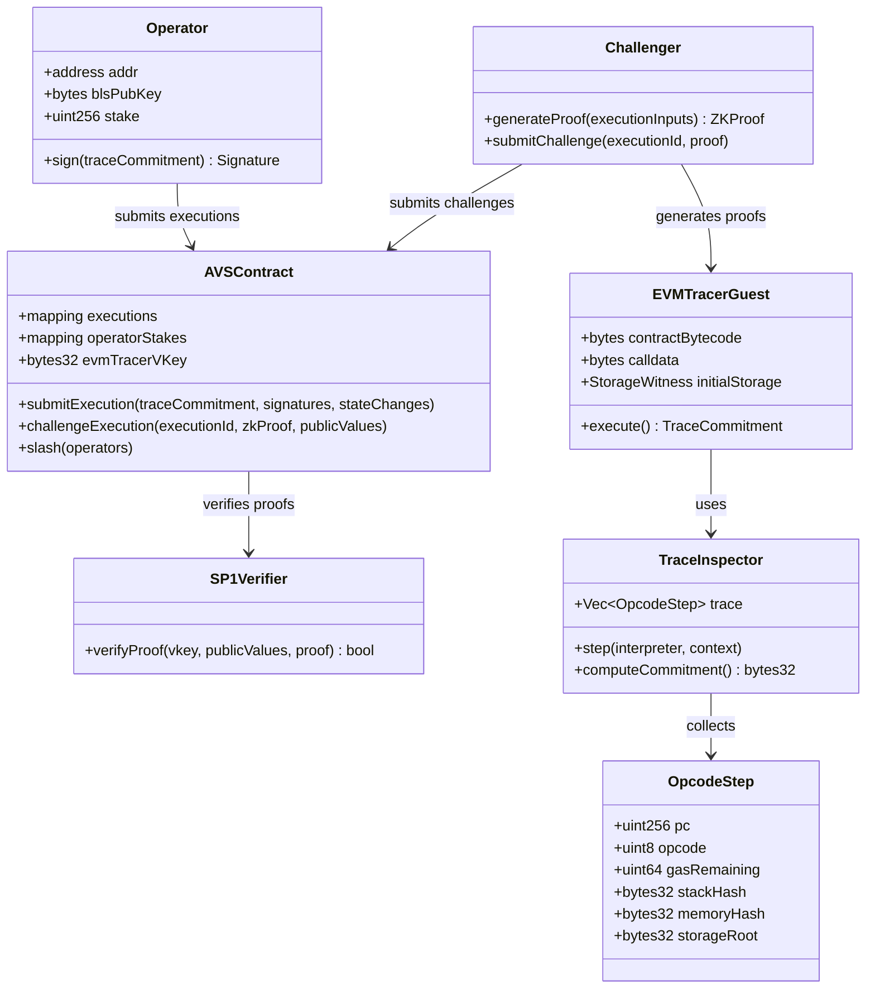
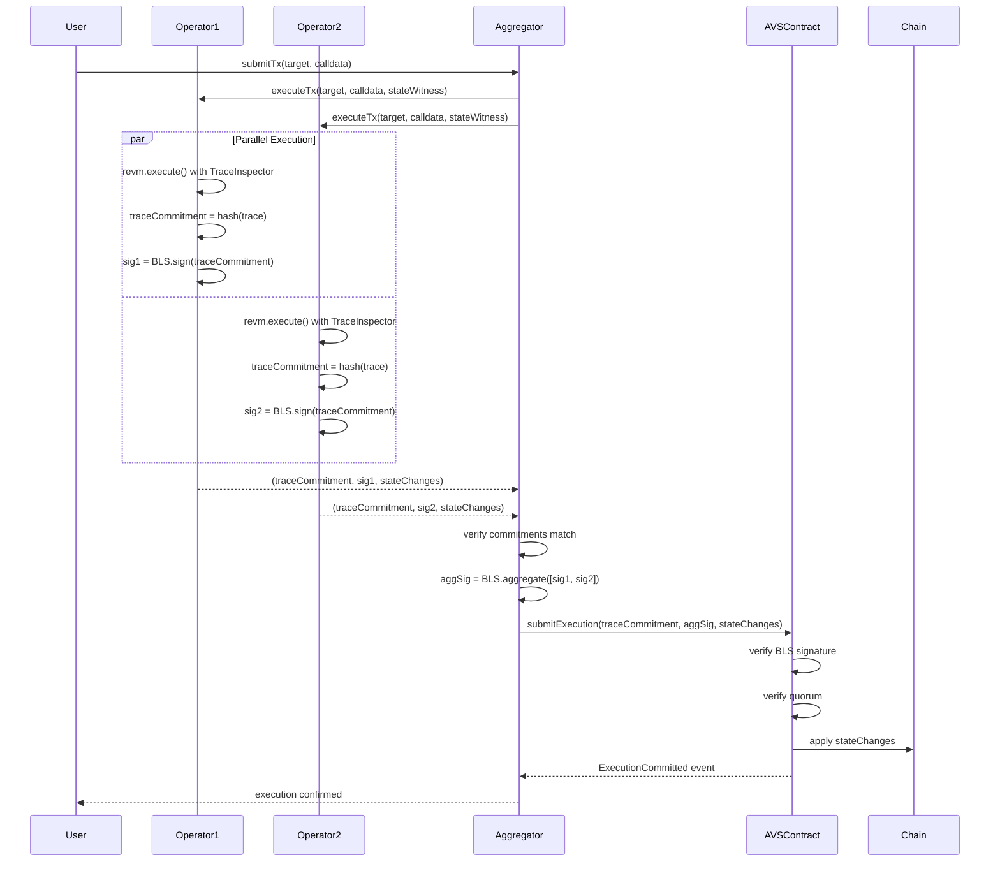
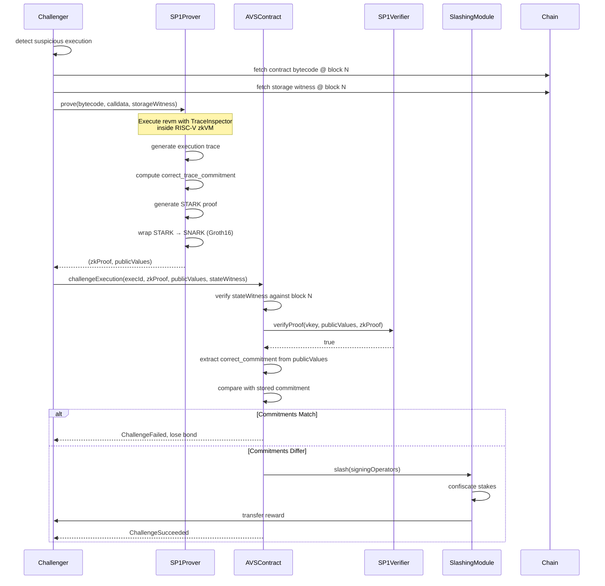
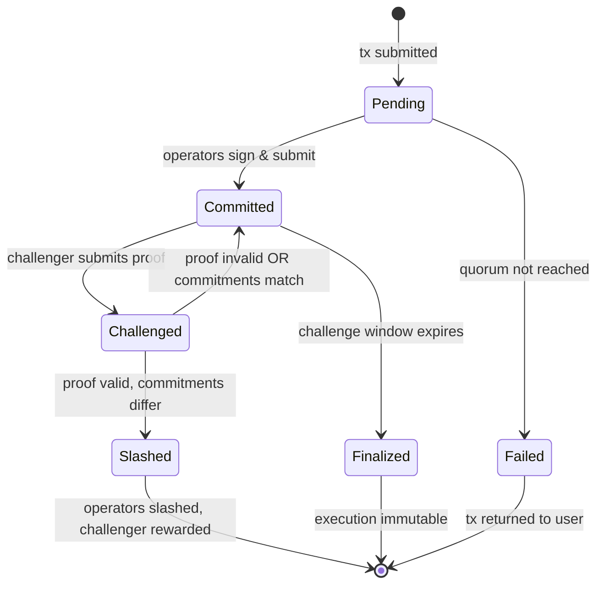
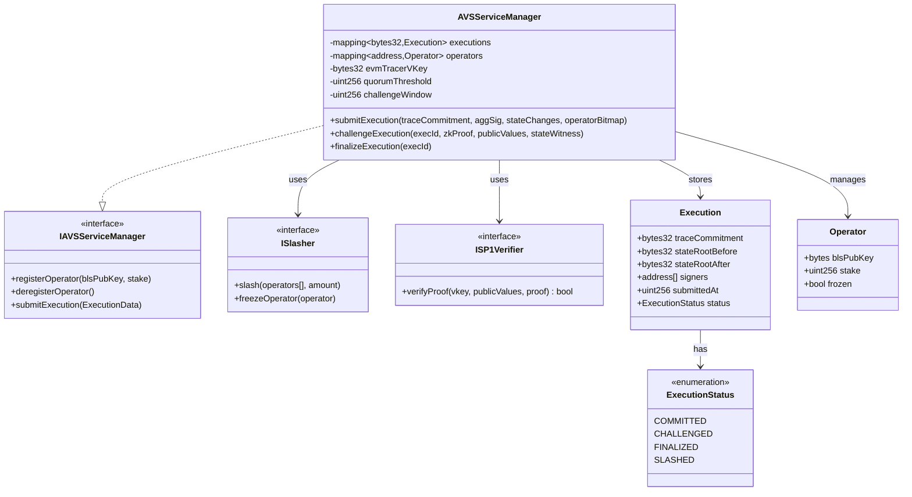

# Technical Specification: ZK-Provable EVM Execution Traces for AVS Fraud Proofs

**Version:** 1.0
**Status:** Draft
**Last Updated:** November 28, 2025

## 1. Background

### Problem Statement

AVS (Actively Validated Service) operators execute EVM transactions off-chain and sign commitments to execution traces. Currently, there is no trustless mechanism to verify that operators signed the correct execution trace. If an operator signs an incorrect trace (either maliciously or due to a bug), there is no way to:

- Prove on-chain that the trace was incorrect
- Slash the operator's stake as penalty
- Revert or correct the invalid state changes

This creates a trust assumption where users must believe operators executed correctly, undermining the security guarantees of the AVS.

### Context / History

| Reference | Description |
|-----------|-------------|
| EigenLayer AVS | Framework for restaking-based validated services |
| Optimism Cannon | MIPS-based interactive fraud proof system |
| Arbitrum Nitro | WASM-based interactive fraud proof system |
| SP1 zkVM | RISC-V zkVM by Succinct Labs |
| revm | Rust EVM implementation with Inspector trait |

**Prior Art:**

- Optimistic rollups use interactive bisection games (7-day challenge windows)
- ZK rollups use validity proofs but require custom circuits
- SP1/RISC Zero enable general-purpose ZK proofs over Rust programs

### Stakeholders

| Stakeholder | Role | Interest |
|-------------|------|----------|
| AVS Operators | Execute transactions, sign traces | Avoid false slashing, minimize overhead |
| AVS Users | Submit transactions | Correct execution, recourse if fraud |
| Challengers | Monitor for fraud | Earn slashing rewards |
| Protocol DAO | Governance | System security, parameter tuning |
| EigenLayer | Infrastructure | Integration compatibility |

## 2. Motivation

### Goals & Success Stories

**Goal 1: Trustless Fraud Proofs**

As a challenger, I can submit a ZK proof that an operator signed an incorrect execution trace, and the operator gets slashed automatically without any interactive game.

**Goal 2: Non-Interactive Verification**

As a user, I don't need to stay online for a 7-day challenge period. Fraud can be proven in a single transaction.

**Goal 3: Deterministic Trace Commitment**

As an operator, I can compute the canonical trace commitment for any transaction using open-source tooling, ensuring I won't be falsely slashed.

**Goal 4: Gas-Efficient On-Chain Verification**

As a challenger, I can verify a fraud proof on-chain for <500k gas, making challenges economically viable.

## 3. Scope and Approaches

### Non-Goals

| Technical Functionality | Reasoning for Being Off Scope | Tradeoffs |
|------------------------|------------------------------|-----------|
| Real-time proving (sub-second) | SP1 proof generation takes 10-60s depending on trace length | Operators must buffer executions; not suitable for MEV-sensitive use cases |
| Proving cross-contract calls to arbitrary external contracts | State witness complexity; requires full state tree | Limits to self-contained executions or known contract sets |
| Privacy of execution inputs | ZK proves correctness, not privacy; inputs are public | Cannot hide transaction parameters |
| Automatic slashing without challenger | Requires liveness assumptions | Relies on economic incentives for challengers |
| Support for EOF (EVM Object Format) | EOF not yet finalized in revm/SP1 ecosystem | May require update when EOF ships |
| L2-specific opcodes (e.g., L1BLOCKHASH) | Focus on standard EVM | Can be extended per-L2 |

### Value Proposition

| Technical Functionality | Value | Tradeoffs |
|------------------------|-------|-----------|
| ZK-proven execution traces | Cryptographic guarantee of correct execution | Proof generation latency (~10-60s) |
| Single-tx fraud proofs | No interactive game, no challenge period | Higher challenger gas cost (~300k) vs optimistic happy path |
| revm-based execution | Battle-tested EVM implementation, easy upgrades | Tied to revm's correctness |
| SP1 on-chain verifier | ~275k gas verification, EVM-native | Requires SP1 verifier contract deployment |
| Deterministic trace format | Canonical commitment, no ambiguity | Rigid format, harder to extend |
| BLS signature aggregation | Compact multi-operator signatures | BLS precompile gas costs |

### Alternative Approaches

| Approach | Pros | Cons |
|----------|------|------|
| Interactive Bisection (Cannon-style) | No proof generation, immediate challenge start | 7+ day challenge period, multiple txs, complex game theory |
| On-chain EVM Interpreter | Fully on-chain, no off-chain prover | Millions of gas for non-trivial traces, impractical |
| Optimistic with bonds | Simple, cheap happy path | Trust assumption during challenge period, MEV opportunities |
| RISC Zero instead of SP1 | Similar capabilities, different proof system | Slightly higher verification costs, less active development |
| Custom ZK circuits | Maximum performance | Months of development, audit costs, hard to maintain |

### Relevant Metrics

| Metric | Target | Measurement |
|--------|--------|-------------|
| Proof generation time | <60s for 10k opcodes | Benchmark on reference hardware |
| On-chain verification gas | <500k gas | Mainnet deployment test |
| False positive rate | 0% | Formal verification of trace format |
| Challenge success rate | 100% for valid challenges | Testnet simulations |
| Operator overhead | <5% latency increase | Production monitoring |

## 4. Step-by-Step Flow

### 4.1 Main ("Happy") Path: Normal Execution

1. **Pre-condition:**
   - AVS contract deployed with SP1 verifier
   - Operators registered with staked collateral
   - Target contract bytecode known and committed

2. User submits transaction request to AVS operators

3. Each operator:
   - a. Loads contract bytecode + initial storage state
   - b. Executes transaction in revm with TraceInspector
   - c. Captures opcode trace: `[(pc, opcode, gas, stack_hash, memory_hash), ...]`
   - d. Computes `trace_commitment = keccak256(rlp_encode(trace))`
   - e. Signs `trace_commitment` with BLS key

4. Aggregator collects signatures:
   - a. Verifies all `trace_commitments` match
   - b. Aggregates BLS signatures
   - c. Extracts SSTORE/CALL operations from trace

5. Aggregator submits to chain:
   - a. State changes (storage writes, ETH transfers)
   - b. Aggregated BLS signature
   - c. `trace_commitment`
   - d. Bitmap of signing operators

6. On-chain contract:
   - a. Verifies BLS signature against registered operator keys
   - b. Verifies quorum threshold met
   - c. Applies state changes
   - d. Emits `ExecutionCommitted(trace_commitment, operators, txHash)`

7. **Post-condition:**
   - State changes applied
   - `trace_commitment` stored for potential challenge
   - Challenge window opens (optional, can be 0 with ZK)

### 4.2 Fraud Proof Path: Challenging Invalid Execution

1. **Pre-condition:**
   - `ExecutionCommitted` event observed
   - Challenger believes `trace_commitment` is incorrect

2. Challenger generates fraud proof:
   - a. Reconstructs execution inputs:
     - Contract bytecode (from chain at block N)
     - Calldata (from original request)
     - Initial storage (Merkle proof from block N)
   - b. Runs SP1 prover with EVM tracer guest program
   - c. Obtains: `(zk_proof, public_values)` where `public_values = (correct_trace_commitment, state_root_before, state_root_after)`

3. Challenger submits challenge transaction:
   ```solidity
   AVSSlasher.challengeExecution(
       executionId,
       zk_proof,
       public_values,
       state_witness  // Merkle proofs for initial state
   )
   ```

4. On-chain verification:
   - a. Verify `state_witness` against block N state root
   - b. Verify `zk_proof` against SP1 verifier contract
   - c. Extract `correct_trace_commitment` from `public_values`
   - d. Compare with stored `trace_commitment` from operators

5a. If commitments match:
   - Challenge fails
   - Challenger loses challenge bond
   - Emit `ChallengeFailed(executionId, challenger)`

5b. If commitments differ:
   - Challenge succeeds
   - Slash all operators who signed incorrect commitment
   - Reward challenger with portion of slashed stake
   - Emit `ChallengeSucceeded(executionId, challenger, slashedAmount)`

6. **Post-condition:**
   - Fraudulent operators slashed
   - Challenger rewarded
   - Execution marked as disputed

### 4.3 Alternate / Error Paths

| # | Condition | System Action | Suggested Handling |
|---|-----------|---------------|-------------------|
| A1 | Operators disagree on trace_commitment | Aggregator cannot form quorum | Return tx to user, log disagreement, trigger operator investigation |
| A2 | ZK proof verification fails | Challenge reverts | Challenger loses gas; likely malformed proof |
| A3 | State witness invalid | Challenge reverts with `InvalidStateWitness` | Challenger must provide valid Merkle proofs |
| A4 | Execution already challenged | Revert with `AlreadyChallenged` | Prevent double-challenge |
| A5 | Challenge window expired | Revert with `ChallengeWindowClosed` | Execution becomes final |
| A6 | Insufficient challenger bond | Revert with `InsufficientBond` | Challenger must stake minimum bond |
| A7 | SP1 verifier contract paused | Challenge reverts | Governance must unpause |
| A8 | Operator already slashed for this execution | Skip slashing, still reward challenger | Prevent double-slashing |
| A9 | Proof generation timeout | Challenger cannot challenge | Increase compute resources or challenge window |
| A10 | revm version mismatch | Trace commitment differs due to implementation | Pin exact revm version in guest program |

## 5. UML Diagrams

### 5.1 System Architecture



### 5.2 Execution Submission Sequence



### 5.3 Challenge/Fraud Proof Sequence



### 5.4 Execution State Machine



### 5.5 Contract Architecture



## 6. Edge Cases and Concessions

### 6.1 Edge Cases

| Edge Case | Description | Handling |
|-----------|-------------|----------|
| Trace length exceeds SP1 limits | Very long transactions (100k+ opcodes) may exceed prover memory | Implement trace chunking with recursive proofs; set max gas limit per execution |
| Storage slot not in witness | Execution accesses storage not provided in Merkle proof | Guest program reverts; challenger must provide complete witness |
| Block reorg after execution | State root changes due to reorg | Challenge must reference canonical block; add reorg protection delay |
| Precompile edge cases | ECRECOVER, SHA256 etc. have implementation-specific behavior | Pin exact precompile implementations in guest; document deviations |
| Gas metering precision | Slight gas differences between revm versions | Include exact gas schedule in trace commitment; tolerate small delta (configurable) |
| CREATE/CREATE2 address derivation | Nonce-dependent addresses | Include nonce in state witness |
| SELFDESTRUCT behavior | Complex semantics, deprecated | Follow EIP-6780 semantics; document handling |
| Concurrent challenges | Multiple challengers submit proofs for same execution | First valid challenge wins; others refunded |
| Operator key rotation | BLS key changes between execution and challenge | Store operator key commitment per execution |

### 6.2 Design Concessions

| Concession | Rationale | Impact | Mitigation |
|------------|-----------|--------|------------|
| No privacy | ZK proves correctness, inputs remain public | Cannot hide transaction parameters | Out of scope; consider future privacy extensions |
| Fixed trace format | Determinism requires rigid structure | Hard to extend without breaking compatibility | Version trace format; migration path for upgrades |
| Single EVM version | Must pin exact revm commit | Cannot auto-upgrade EVM rules | Governance-controlled upgrade process |
| Challenger must front gas | Verification costs ~300k gas | Barrier for small-stake challengers | Implement challenger pools; subsidize gas |
| No partial slashing | All signers of bad trace slashed equally | Minority honest operators still slashed | Require unanimous signing; add dissent mechanism |
| Proof generation latency | 10-60s proof time | Not suitable for real-time applications | Use optimistic path with ZK as backstop |

### 6.3 Known Limitations

1. **State witness size:** For contracts with large storage, the Merkle proof can be significant (100KB+). This increases calldata costs for challenges.

2. **Prover hardware requirements:** SP1 proving requires 16GB+ RAM and ideally GPU acceleration. Not all challengers may have access.

3. **revm compatibility:** Any bug in revm affects the canonical trace. Must track revm security advisories.

4. **BLS aggregation gas:** Verifying BLS signatures on-chain costs ~100k gas per unique pubkey. Aggregation helps but has limits.

## 7. Open Questions

| # | Question | Owner | Status | Resolution |
|---|----------|-------|--------|------------|
| Q1 | What is the minimum challenge bond amount? | Protocol DAO | Open | Must balance spam prevention vs accessibility |
| Q2 | Should we support EIP-4844 blob data for witness submission? | Engineering | Open | Could reduce challenge costs by 10x |
| Q3 | How to handle EVM upgrades (e.g., Pectra)? | Engineering | Open | Need versioned guest programs and migration |
| Q4 | What's the optimal quorum threshold? | Protocol DAO | Open | Trade-off: security vs liveness |
| Q5 | Should trace include memory snapshots? | Engineering | Open | More complete but larger proofs |
| Q6 | Integration with EigenLayer's native slashing? | Engineering | Open | Depends on EigenLayer M2 slashing design |
| Q7 | How to handle gas price oracle for challenger rewards? | Engineering | Open | Fixed reward vs gas-proportional |
| Q8 | Should we support parallel proving? | Engineering | Open | Would reduce latency for long traces |
| Q9 | What's the SLA for Succinct prover network? | External | Open | Dependency on third-party infrastructure |
| Q10 | Formal verification scope for guest program? | Security | Open | At minimum: trace commitment computation |

## 8. Glossary / References

### Glossary

| Term | Definition |
|------|------------|
| AVS | Actively Validated Service - a service secured by restaked ETH on EigenLayer |
| zkVM | Zero-Knowledge Virtual Machine - a VM that produces cryptographic proofs of execution |
| SP1 | Succinct Processor 1 - a RISC-V based zkVM by Succinct Labs |
| revm | Rust EVM - a Rust implementation of the Ethereum Virtual Machine |
| Trace Commitment | A cryptographic hash of the full opcode execution trace |
| Guest Program | The Rust program that runs inside the zkVM |
| State Witness | Merkle proofs providing the initial state for re-execution |
| BLS | Boneh-Lynn-Shacham - a signature scheme supporting aggregation |
| STARK | Scalable Transparent Argument of Knowledge - a proof system |
| SNARK | Succinct Non-interactive Argument of Knowledge - a compact proof |
| Groth16 | A SNARK construction used for on-chain verification |
| Inspector | revm trait for hooking into EVM execution steps |
| Challenge Window | Time period during which an execution can be disputed |
| Quorum | Minimum threshold of operator signatures required |

### References

| Resource | URL |
|----------|-----|
| SP1 Documentation | https://docs.succinct.xyz |
| SP1 GitHub | https://github.com/succinctlabs/sp1 |
| SP1 Contracts (Verifier) | https://github.com/succinctlabs/sp1-contracts |
| revm GitHub | https://github.com/bluealloy/revm |
| revm-inspectors | https://github.com/paradigmxyz/revm-inspectors |
| EigenLayer Docs | https://docs.eigenlayer.xyz |
| Optimism Cannon | https://github.com/ethereum-optimism/optimism/tree/develop/cannon |
| Arbitrum Nitro | https://github.com/OffchainLabs/nitro |
| RISC Zero (Alternative) | https://github.com/risc0/risc0 |
| Zeth (RISC Zero zkEVM) | https://github.com/risc0/zeth |
| SP1 Reth | https://github.com/succinctlabs/sp1-reth |
| EVM Opcodes Reference | https://www.evm.codes |
| BLS Signatures EIP | https://eips.ethereum.org/EIPS/eip-2537 |

## Appendix A: Trace Format Specification

```rust
/// A single step in the EVM execution trace
#[derive(Serialize, Deserialize, Clone)]
pub struct OpcodeStep {
    /// Program counter
    pub pc: u64,
    /// Opcode byte (0x00-0xFF)
    pub opcode: u8,
    /// Gas remaining before this step
    pub gas_remaining: u64,
    /// Gas cost of this opcode
    pub gas_cost: u64,
    /// Keccak256 of stack contents (top 16 items)
    pub stack_hash: [u8; 32],
    /// Keccak256 of memory contents
    pub memory_hash: [u8; 32],
    /// Current call depth
    pub depth: u16,
    /// For SSTORE: (slot, old_value, new_value)
    pub storage_change: Option<StorageChange>,
    /// For CALL/DELEGATECALL/etc: call info
    pub call_info: Option<CallInfo>,
}

/// Storage modification record
#[derive(Serialize, Deserialize, Clone)]
pub struct StorageChange {
    pub slot: [u8; 32],
    pub old_value: [u8; 32],
    pub new_value: [u8; 32],
}

/// External call record
#[derive(Serialize, Deserialize, Clone)]
pub struct CallInfo {
    pub target: [u8; 20],
    pub value: [u8; 32],
    pub input_hash: [u8; 32],
    pub gas_limit: u64,
}

/// Full execution trace
#[derive(Serialize, Deserialize)]
pub struct ExecutionTrace {
    pub version: u8,  // Trace format version
    pub chain_id: u64,
    pub block_number: u64,
    pub contract: [u8; 20],
    pub caller: [u8; 20],
    pub calldata_hash: [u8; 32],
    pub steps: Vec<OpcodeStep>,
    pub result: ExecutionResult,
}

/// Compute canonical trace commitment
pub fn compute_trace_commitment(trace: &ExecutionTrace) -> [u8; 32] {
    keccak256(&bincode::serialize(trace).unwrap())
}
```

## Appendix B: Gas Estimates

| Operation | Estimated Gas | Notes |
|-----------|---------------|-------|
| Submit execution (happy path) | ~150k + state changes | BLS verification + storage writes |
| Submit challenge | ~350k | ZK proof verification + state reads |
| Slash operators | ~50k per operator | Storage updates |
| Finalize execution | ~30k | Status update |
