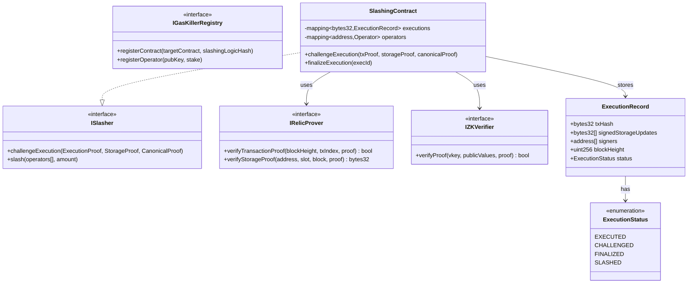

# Technical Specification: ZK-Provable Slashing for Gas Killer AVS

**Version:** 1.0
**Status:** Draft
**Last Updated:** November 28, 2025

## 1. Background

### Problem Statement

Gas Killer (GK) operators execute EVM transactions off-chain and sign commitments to storage slot updates. Users call **target functions** (auto-generated wrappers) instead of **canonical functions** (the original Solidity functions), with operators signing the expected state changes. Currently, there is no trustless mechanism to verify that operators signed correct storage slot updates. If an operator signs incorrect updates (either maliciously or due to a bug), there is no way to:

- Prove on-chain that the signed storage updates were incorrect
- Slash the operator's stake as penalty
- Maintain cryptoeconomic security (CoC > PfC)

This creates a trust assumption where users must believe operators executed correctly, undermining the security guarantees of the AVS.

### Cryptoeconomic Security

_Cryptoeconomic security_ (CES) requires that the Cost of Corruption (CoC) exceeds the Profit from Corruption (PfC).

Given a set of colluding validators (the _attacker_), we assume they can corrupt the majority of validators and manipulate consensus. The attacker must weigh:

- **CoC**: Total resources required to attack (primarily slashed stake)
- **PfC**: Profit from manipulating execution results

**As long as CoC > PfC, the protocol is cryptoeconomically secure.** For GasKiller to maintain this property, each malicious coordinated attack must be objectively provable through a smart contract on Ethereum.

### Context / History

| Reference | Description |
|-----------|-------------|
| [Gas Killer](https://gaskiller.xyz) | Gas optimization AVS for EVM transactions |
| [GK Architecture](https://www.canva.com/design/DAGhFbNxbGM/wNLvx0uDVPicY5tweLKDBQ/edit) | System design diagrams |
| EigenLayer AVS | Framework for restaking-based validated services |
| [Relic Protocol](https://docs.relicprotocol.com/) | On-chain storage/transaction proof system |
| [RISC Zero Zeth](https://risczero.com/zeth) | ZK EVM execution prover |
| SP1 zkVM | RISC-V zkVM by Succinct Labs |
| revm | Rust EVM implementation with Inspector trait |

**Prior Art:**

- Optimistic rollups use interactive bisection games (7-day challenge windows)
- ZK rollups use validity proofs but require custom circuits
- SP1/RISC Zero enable general-purpose ZK proofs over Rust programs
- Relic Protocol provides proven storage slots and transaction inclusion on Ethereum mainnet

### Key Definitions

| Term | Definition |
|------|------------|
| **Target Contract** | A contract with existing Solidity functions seeking gas savings via Gas Killer; typically subsidized by an institution |
| **Canonical Function** | The original Solidity function a Gas Killer consumer wants to optimize |
| **Target Function** | Auto-generated function replicating canonical function parameters, plus GK parameters (storage slot updates, external calls, events) |
| **Slashing Function** | Function that returns true to authorize slashing; accepts proofs of malicious behavior |
| **Slasher** | An interested party willing to pay for and run slashing services |

### Stakeholders

| Stakeholder | Role | Interest |
|-------------|------|----------|
| GK Consumers | Deploy GK-compliant contracts | Gas savings, correct execution |
| GK Operators | Execute transactions, sign storage updates | Avoid false slashing, minimize overhead |
| Slashers | Monitor for fraud, submit challenges | Earn slashing rewards |
| Protocol DAO | Governance | System security, parameter tuning |
| EigenLayer | Infrastructure | Integration compatibility |

## 2. Motivation

### Goals & Success Stories

**Goal 1: Cryptoeconomic Security**

For each malicious coordinated attack by the GK operator set, there is an objective way to determine that action is malicious through a smart contract on Ethereum, enabling slashing.

**Goal 2: Trustless Fraud Proofs**

As a slasher, I can submit a ZK proof that operators signed incorrect storage slot updates, and operators get slashed automatically without any interactive game.

**Goal 3: Non-Interactive Verification**

As a user, I don't need to stay online for a 7-day challenge period. Fraud can be proven in a single transaction.

**Goal 4: Deterministic Canonical Execution**

As an operator, I can compute the canonical storage slot updates for any transaction using open-source tooling, ensuring I won't be falsely slashed.

**Goal 5: Gas-Efficient On-Chain Verification**

As a slasher, I can verify a fraud proof on-chain for <500k gas, making challenges economically viable.

## 3. Scope and Approaches

### Affordances

The slashing mechanism has several favorable properties:

- Slashing may be expensive to invoke (acceptable tradeoff)
- Slashing process may be interactive (multi-step)
- Slashing does not have to happen instantly
- All slashing logic can be committed and deployed only when needed
- Proving storage slots and transaction inclusion is solved by [Relic Protocol](https://docs.relicprotocol.com/developers/contract-addresses/) for Ethereum mainnet
- We assume an interested slasher will pay for and run slashing services
- The operator network can detect and ignore non-canonical target contract implementations designed to cause malicious slashing

### Requirements

For a valid slashing proof:

1. The transaction must be proven to have been executed at some blockheight and transaction index
2. The transaction must be proven to have called the target function of a canonical function
3. The storage layout of the contract at execution time must be proven
4. The canonical function execution storage slot update results must be proven
5. The signed (and executed) storage slot updates must be proven different from canonical execution

### Non-Goals

| Technical Functionality | Reasoning for Being Off Scope | Tradeoffs |
|------------------------|------------------------------|-----------|
| Real-time proving (sub-second) | ZK proof generation takes 10-60s | Operators must buffer; not MEV-suitable |
| Universal EVM chain support | Focus on Ethereum mainnet first | Relic Protocol bootstraps mainnet; other chains need equivalent proofs |
| Privacy of execution inputs | ZK proves correctness, not privacy | Transaction parameters remain public |
| Automatic slashing without slasher | Requires liveness assumptions | Relies on economic incentives |
| L2-specific opcodes | Focus on standard EVM | Can extend per-L2 later |

### Value Proposition

| Technical Functionality | Value | Tradeoffs |
|------------------------|-------|-----------|
| ZK-proven canonical execution | Cryptographic guarantee of correct storage updates | Proof generation latency (~10-60s) |
| Single-tx fraud proofs | No interactive game, no challenge period | Higher slasher gas cost (~300-500k) |
| Relic Protocol integration | Proven storage slots and tx inclusion on mainnet | Mainnet-first, other chains need alternatives |
| revm-based execution | Battle-tested EVM implementation | Tied to revm's correctness |
| SP1/RISC Zero on-chain verifier | ~275k gas verification, EVM-native | Requires verifier contract deployment |
| Lazy slashing logic deployment | Deploy only when needed | Initial hash commitment required |

### Alternative Approaches

| Approach | Pros | Cons |
|----------|------|------|
| Interactive Bisection (Cannon-style) | No proof generation, immediate challenge start | 7+ day challenge period, multiple txs |
| On-chain EVM Interpreter | Fully on-chain | Millions of gas, impractical |
| Optimistic with bonds | Simple, cheap happy path | Trust assumption during challenge window |
| Non-ZK canonical execution proof | May be cheaper to implement | Potentially more expensive on-chain |
| RISC Zero vs SP1 | Similar capabilities | Different performance/cost profiles |

**Note:** Per the original spec, if a non-ZK approach for proving canonical execution can be easily written, even if expensive, that is preferable to a ZK approach.

### Relevant Metrics

| Metric | Target | Measurement |
|--------|--------|-------------|
| Proof generation time | <60s for typical functions | Benchmark on reference hardware |
| On-chain verification gas | <500k gas | Mainnet deployment test |
| False positive rate | 0% | Formal verification of comparison logic |
| Challenge success rate | 100% for valid challenges | Testnet simulations |
| CoC/PfC ratio | >1 for all attack vectors | Economic modeling |

## 4. Step-by-Step Flow

### 4.1 Setup: Contract Deployment

1. **GK Consumer** deploys a Gas Killer-compliant target contract
2. **GK Consumer** commits a hash of slashing logic to the SlashingContract
3. Target contract includes both:
   - Original canonical functions
   - Auto-generated target functions accepting GK parameters

### 4.2 Main ("Happy") Path: Normal Execution

1. **Pre-condition:**
   - GK-compliant target contract deployed
   - Slashing logic hash committed
   - Operators registered with staked collateral

2. User submits transaction request to GK operators

3. Each operator:
   - a. Loads contract bytecode + storage state at current block
   - b. Simulates canonical function execution in revm
   - c. Extracts expected storage slot updates
   - d. Signs the storage slot updates with their key

4. Aggregator collects signatures:
   - a. Verifies all operators agree on storage updates
   - b. Aggregates signatures (BLS if applicable)

5. Aggregator submits to chain:
   - a. Calls target function with signed storage slot updates
   - b. Includes aggregated signature and operator bitmap

6. Target contract:
   - a. Verifies operator signatures
   - b. Applies storage slot updates directly (skipping execution)
   - c. Emits events as specified

7. **Post-condition:**
   - Storage updates applied (gas saved vs canonical execution)
   - Transaction recorded for potential challenge

### 4.3 Fraud Proof Path: Slashing Invalid Execution


**Detailed Steps:**

1. **Pre-condition:**
   - Malicious transaction executed and recorded
   - Slasher detects suspicious behavior

2. **Step 1: Prove Transaction Execution**
   - Slasher provides proof of transaction execution at specific blockheight and tx index
   - Uses Relic Protocol or equivalent for Ethereum mainnet

3. **Step 2: Prove Target Function Call**
   - Slasher provides unhashed target function parameters
   - Proves these parameters are included in the proven transaction

4. **Step 3: Prove Storage Layout**
   - Slasher provides proof of target contract storage layout at execution time
   - Uses Merkle proofs against block state root

5. **Step 4: Prove Canonical Execution Result**
   - **Option A (ZK):** Run SP1/RISC Zero prover with revm guest program
   - **Option B (Non-ZK):** On-chain simulation if gas-feasible
   - Output: Expected storage slot updates from canonical function

6. **Step 5: Compare Results**
   - SlashingContract compares:
     - Signed storage slot updates (from target function tx)
     - Expected storage slot updates (from canonical simulation)

7. **Outcome:**
   - If match: Challenge fails, slasher loses bond
   - If differ: Challenge succeeds, operators slashed, slasher rewarded

### 4.4 Alternate / Error Paths

| # | Condition | System Action | Handling |
|---|-----------|---------------|----------|
| A1 | Operators disagree on storage updates | Aggregator cannot form quorum | Return tx to user |
| A2 | ZK proof verification fails | Challenge reverts | Slasher loses gas |
| A3 | Storage witness invalid | Challenge reverts | Slasher must provide valid proofs |
| A4 | Transaction already challenged | Revert with `AlreadyChallenged` | Prevent double-challenge |
| A5 | Challenge window expired | Revert with `ChallengeWindowClosed` | Execution finalized |
| A6 | Insufficient slasher bond | Revert with `InsufficientBond` | Must stake minimum |
| A7 | Non-canonical target contract detected | Operators ignore request | Prevents malicious slashing setup |
| A8 | Operator already slashed | Skip slashing, reward slasher | Prevent double-slashing |
| A9 | Proof generation timeout | Slasher cannot challenge | Increase resources or window |
| A10 | revm version mismatch | Different results due to implementation | Pin exact revm version |

## 5. UML Diagrams

### 5.1 System Architecture


### 5.2 Execution State Machine


### 5.3 Contract Architecture



## 6. Proving Canonical Execution

### 6.1 Approach Selection

Two approaches exist for proving canonical function execution:

**Option A: ZK Proof (SP1/RISC Zero)**
- Run revm inside zkVM guest program
- Generate STARK proof, wrap to SNARK for on-chain verification
- ~275k gas verification
- 10-60s proof generation

**Option B: On-Chain Simulation**
- Deploy EVM interpreter on-chain
- Execute canonical function directly
- Potentially millions of gas for complex functions
- No off-chain proving required

Per the original spec: "If a non-ZK approach can be easily written as opposed to a ZK one for proving canonical method execution, even if it is very expensive, that is preferable."

### 6.2 ZK Guest Program Design

For the ZK approach, the guest program:

1. **Inputs (private):**
   - Contract bytecode
   - Calldata (canonical function params)
   - Storage slots at execution time (with Merkle proofs)

2. **Execution:**
   - Run revm with provided inputs
   - Capture all SSTORE operations

3. **Outputs (public):**
   - Hash of expected storage slot updates
   - State root before/after
   - Commitment to inputs (for verification)

### 6.3 Leveraging Relic Protocol

For Ethereum mainnet, [Relic Protocol](https://docs.relicprotocol.com/developers/contract-addresses/) provides:

- Proven transaction inclusion at specific blockheight
- Proven storage slot values at specific blocks
- No need to implement custom proof systems

**Multi-Chain Extension:** By requiring operators to sign a blockhash on any target chain, we may be able to prove anything from that blockhash on Ethereum for the arbitrary chain.

## 7. Edge Cases and Concessions

### 7.1 Edge Cases

| Edge Case | Description | Handling |
|-----------|-------------|----------|
| Complex canonical function | Large loops or many storage ops | May exceed ZK prover limits; set gas caps |
| Storage slot not in witness | Execution accesses unproven storage | Guest reverts; slasher must provide complete witness |
| Block reorg after execution | State changes due to reorg | Challenge must reference canonical block |
| External calls in canonical | Canonical function calls other contracts | Requires expanded state witness |
| Non-canonical target contract | Malicious contract designed to cause false slashing | Operators detect and ignore |
| Concurrent challenges | Multiple slashers submit proofs | First valid challenge wins; others refunded |

### 7.2 Design Concessions

| Concession | Rationale | Impact | Mitigation |
|------------|-----------|--------|------------|
| Mainnet-first | Relic Protocol available on Ethereum | Other chains need equivalent proofs | Multi-chain extension via signed blockhash |
| Lazy slashing logic | Deploy only when needed | Requires upfront hash commitment | Standard practice, reduces deployment cost |
| Slasher must front gas | Verification costs ~300-500k | Barrier for small challenges | Slasher pools; subsidized gas |
| Non-interactive proofs | Simpler than bisection games | Potentially higher one-time cost | ZK verification is efficient |

### 7.3 Known Limitations

1. **State witness size:** Complex contracts may need large Merkle proofs (100KB+)
2. **Prover hardware:** ZK proving requires 16GB+ RAM, ideally GPU
3. **Chain coverage:** Relic Protocol only on Ethereum mainnet initially
4. **revm compatibility:** Any revm bug affects canonical computation

## 8. Open Questions

| # | Question | Owner | Status |
|---|----------|-------|--------|
| Q1 | Minimum slasher bond amount? | DAO | Open |
| Q2 | Support EIP-4844 blobs for witness data? | Engineering | Open |
| Q3 | How to handle EVM upgrades (Pectra, etc.)? | Engineering | Open |
| Q4 | Optimal quorum threshold? | DAO | Open |
| Q5 | ZK vs on-chain simulation for MVP? | Engineering | Open |
| Q6 | Integration with EigenLayer native slashing? | Engineering | Open |
| Q7 | Multi-chain blockhash signing scheme? | Engineering | Open |
| Q8 | SLA for prover network? | External | Open |
| Q9 | Formal verification scope? | Security | Open |
| Q10 | Non-canonical contract detection mechanism? | Engineering | Open |

## 9. Glossary / References

### Glossary

| Term | Definition |
|------|------------|
| Gas Killer (GK) | AVS that optimizes gas by having operators sign expected state changes |
| Target Contract | Contract deployed with GK-compliant target functions |
| Canonical Function | Original Solidity function to be optimized |
| Target Function | Auto-generated wrapper accepting signed storage updates |
| Slasher | Party who monitors and challenges malicious behavior |
| CoC | Cost of Corruption - resources needed to attack |
| PfC | Profit from Corruption - gains from successful attack |
| Relic Protocol | On-chain proof system for storage/transaction inclusion |
| zkVM | Zero-Knowledge Virtual Machine |
| SP1 | Succinct Processor 1 - RISC-V based zkVM |
| revm | Rust EVM implementation |
| State Witness | Merkle proofs providing storage state |

### References

| Resource | URL |
|----------|-----|
| Gas Killer | https://gaskiller.xyz |
| Gas Killer Solidity | https://github.com/BreadchainCoop/gas-killer-solidity |
| Relic Protocol Docs | https://docs.relicprotocol.com |
| Relic Contract Addresses | https://docs.relicprotocol.com/developers/contract-addresses/ |
| RISC Zero Zeth | https://risczero.com/zeth |
| SP1 Documentation | https://docs.succinct.xyz |
| SP1 GitHub | https://github.com/succinctlabs/sp1 |
| revm GitHub | https://github.com/bluealloy/revm |
| EigenLayer Docs | https://docs.eigenlayer.xyz |

## Appendix A: Storage Update Format

```rust
/// A storage slot update record
#[derive(Serialize, Deserialize, Clone)]
pub struct StorageUpdate {
    /// Contract address
    pub contract: [u8; 20],
    /// Storage slot
    pub slot: [u8; 32],
    /// Previous value
    pub old_value: [u8; 32],
    /// New value
    pub new_value: [u8; 32],
}

/// Signed execution result from operators
#[derive(Serialize, Deserialize)]
pub struct SignedExecution {
    /// Chain ID
    pub chain_id: u64,
    /// Block number at execution
    pub block_number: u64,
    /// Target contract
    pub target: [u8; 20],
    /// Canonical function selector
    pub canonical_selector: [u8; 4],
    /// Calldata hash
    pub calldata_hash: [u8; 32],
    /// Storage updates
    pub updates: Vec<StorageUpdate>,
    /// External calls to perform
    pub external_calls: Vec<ExternalCall>,
    /// Events to emit
    pub events: Vec<EventLog>,
}

/// Compute canonical update commitment
pub fn compute_update_commitment(exec: &SignedExecution) -> [u8; 32] {
    keccak256(&bincode::serialize(exec).unwrap())
}
```

## Appendix B: Gas Estimates

| Operation | Estimated Gas | Notes |
|-----------|---------------|-------|
| Target function execution | ~50k + updates | Much cheaper than canonical |
| Submit challenge (ZK) | ~350k | Proof verification + state reads |
| Submit challenge (non-ZK) | Varies | Depends on canonical complexity |
| Slash operators | ~50k per operator | Storage updates |
| Finalize execution | ~30k | Status update |
| Relic storage proof verification | ~50k per slot | Merkle proof verification |

## Appendix C: Slashing Logic Commitment

The slashing logic can be committed as a hash and deployed only when needed:

```solidity
// At deployment time
bytes32 public slashingLogicHash;

constructor(bytes32 _slashingLogicHash) {
    slashingLogicHash = _slashingLogicHash;
}

// At challenge time
function deploySlashingLogic(bytes memory slashingBytecode) external {
    require(keccak256(slashingBytecode) == slashingLogicHash, "Invalid bytecode");
    // Deploy and execute slashing logic
}
```

This allows:
- Minimal upfront deployment cost
- Slashing logic only materialized when needed
- Hash commitment ensures logic cannot be changed
