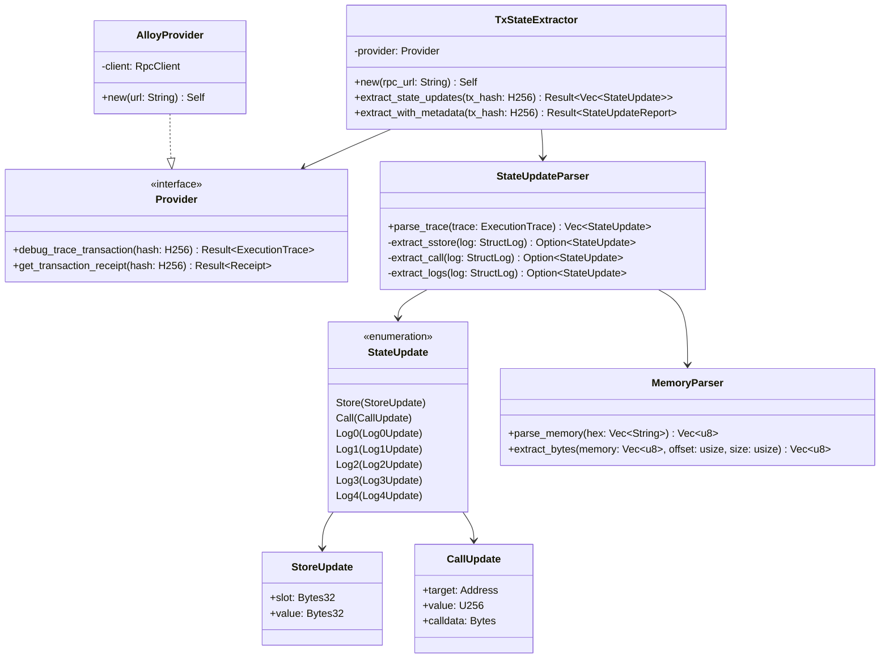
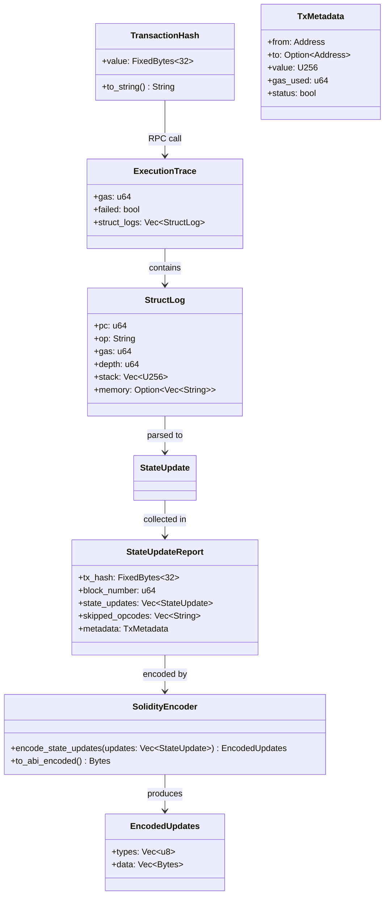
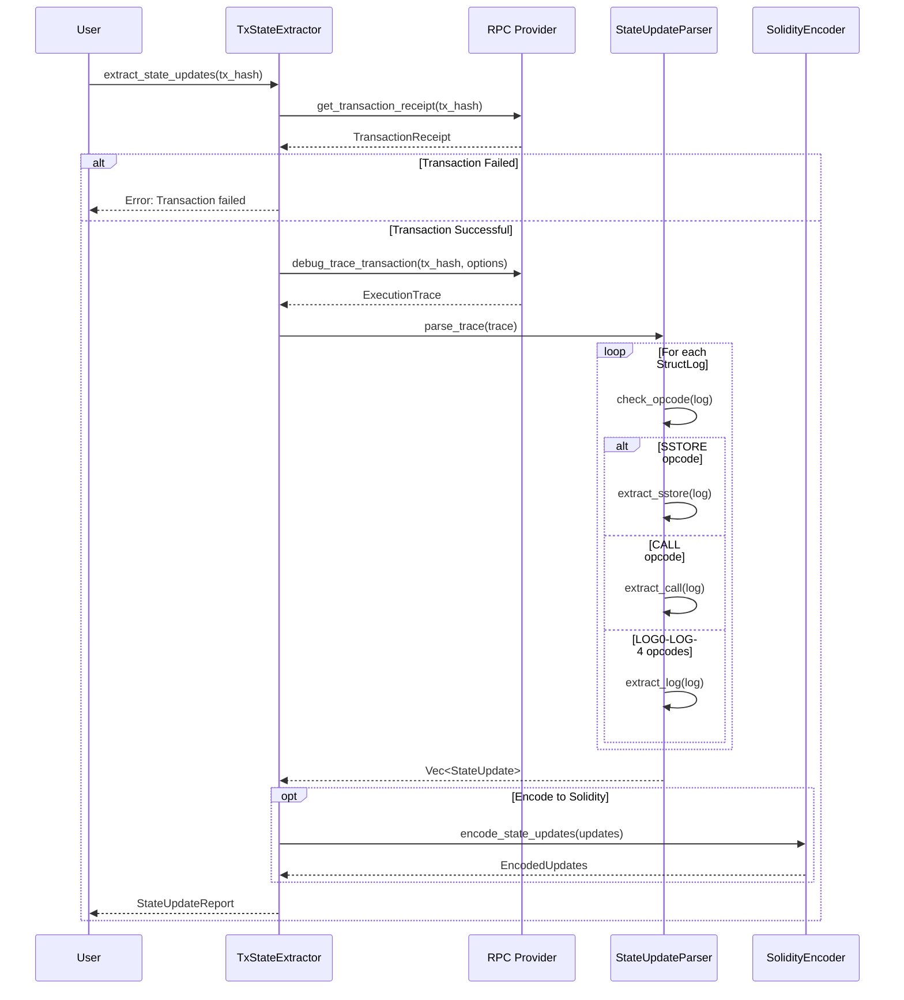
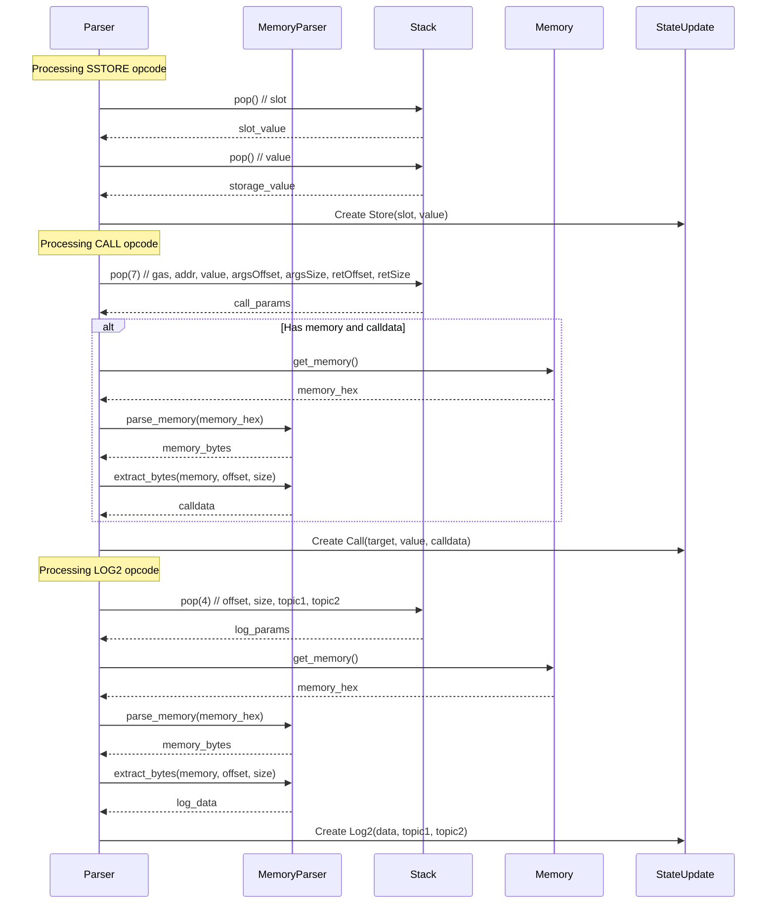

# Extracting Transaction Hash to State Updates Component

## Problem Statement

The current gas-analyzer-rs system is a comprehensive tool that analyzes Ethereum transactions, extracts state updates, and estimates gas consumption using a custom "GasKiller" approach. However, there is a need for a **lightweight, standalone component** that can:

1. Accept a transaction hash as input
2. Extract all state-changing operations from that transaction
3. Return the state updates in a Solidity-compatible structure
4. Operate independently without the gas estimation overhead

This extraction would enable:
- Integration into other analysis tools
- Real-time transaction monitoring systems
- Smart contract verification tools
- State diff generation for debugging
- Lightweight transaction replay mechanisms

## Introduction

The gas-analyzer-rs codebase contains sophisticated logic for tracing Ethereum transactions and extracting state updates. The core functionality involves:

1. **Transaction Tracing**: Using Ethereum's debug API to obtain detailed execution traces
2. **State Update Extraction**: Parsing EVM opcodes to identify state-changing operations
3. **Data Structuring**: Converting raw trace data into typed Solidity structures

The challenge is to extract these components while:
- Minimizing dependencies
- Maintaining type safety
- Preserving the ability to handle complex transactions (delegate calls, nested calls)
- Ensuring compatibility with Solidity data structures

## Architectural Approaches

### Approach 1: Minimal Extraction Library

**Description**: Extract only the essential tracing and parsing logic into a standalone Rust library.

**Components to Extract**:
- Transaction tracer (`get_tx_trace`)
- State update parser (`compute_state_updates`, `append_to_state_updates`)
- Type definitions (`StateUpdate` enum, Solidity types)
- Memory/stack parsing utilities

**Dependencies**:
- Alloy framework (for RPC and types)
- Tokio (async runtime)
- Anyhow (error handling)

**Trade-offs**:
- ✅ **Pros**: 
  - Minimal footprint (~500 lines of code)
  - Fast compilation
  - Easy to audit and understand
  - Direct RPC integration
- ❌ **Cons**:
  - Requires reimplementing some utility functions
  - No gas estimation capabilities
  - Limited extensibility

### Approach 2: Modular Component System

**Description**: Create a modular system with pluggable components for different aspects of transaction analysis.

**Architecture**:
```
Core Module
├── Tracer (pluggable providers)
├── Parser (configurable opcodes)
├── Formatter (multiple output formats)
└── Validator (optional verification)
```

**Trade-offs**:
- ✅ **Pros**:
  - Highly extensible
  - Support for multiple RPC providers
  - Configurable opcode filtering
  - Multiple output formats (JSON, Solidity, ABI)
- ❌ **Cons**:
  - More complex architecture
  - Larger codebase
  - Potential over-engineering for simple use cases

### Approach 3: Microservice Architecture

**Description**: Deploy as a lightweight HTTP service that exposes transaction analysis endpoints.

**API Design**:
```
POST /analyze
{
  "tx_hash": "0x...",
  "rpc_url": "https://..."
}

Response:
{
  "state_updates": [...],
  "metadata": {...}
}
```

**Trade-offs**:
- ✅ **Pros**:
  - Language-agnostic consumption
  - Centralized caching
  - Easy horizontal scaling
  - No client-side dependencies
- ❌ **Cons**:
  - Network overhead
  - Deployment complexity
  - Requires infrastructure management

### Approach 4: WASM Module

**Description**: Compile the core logic to WebAssembly for browser and Node.js compatibility.

**Trade-offs**:
- ✅ **Pros**:
  - Universal JavaScript compatibility
  - Browser-native execution
  - No server infrastructure needed
  - NPM distribution
- ❌ **Cons**:
  - WASM compilation complexity
  - Potential performance overhead
  - Limited async support in WASM
  - RPC provider limitations in browser

## Recommended Approach: Hybrid Library with Optional Features

Based on the analysis, I recommend a **hybrid approach** that combines the simplicity of Approach 1 with selective modularity from Approach 2:

### Core Library Structure

```rust
tx-state-extractor/
├── src/
│   ├── lib.rs           // Public API
│   ├── tracer.rs        // Transaction tracing
│   ├── parser.rs        // State update extraction
│   ├── types.rs         // Type definitions
│   ├── memory.rs        // Memory/stack utilities
│   └── provider.rs      // RPC provider abstraction
├── examples/
│   └── basic_usage.rs
└── Cargo.toml
```

## Class Diagrams

### Core Components Class Diagram



### Data Flow Class Diagram



## Sequence Diagrams

### Basic Transaction Analysis Flow



### Detailed State Update Extraction



## Example Code Snippets

### Basic Usage Example

```rust
use tx_state_extractor::{TxStateExtractor, StateUpdate};
use alloy::primitives::FixedBytes;

#[tokio::main]
async fn main() -> Result<(), Box<dyn std::error::Error>> {
    // Initialize the extractor with an RPC endpoint
    let extractor = TxStateExtractor::new("https://eth-mainnet.g.alchemy.com/v2/YOUR_KEY")?;
    
    // Parse transaction hash
    let tx_hash = "0x1234...".parse::<FixedBytes<32>>()?;
    
    // Extract state updates
    let state_updates = extractor.extract_state_updates(tx_hash).await?;
    
    // Process the updates
    for update in state_updates {
        match update {
            StateUpdate::Store(store) => {
                println!("Storage: slot={:?}, value={:?}", store.slot, store.value);
            }
            StateUpdate::Call(call) => {
                println!("Call: to={:?}, value={:?}", call.target, call.value);
            }
            StateUpdate::Log2(log) => {
                println!("Log2: topics={:?}, {:?}", log.topic1, log.topic2);
            }
            _ => {}
        }
    }
    
    Ok(())
}
```

### Core Extractor Implementation

```rust
// src/lib.rs
use alloy::providers::{Provider, ProviderBuilder};
use alloy::rpc::types::trace::{GethDebugTracingOptions, GethDefaultTracingOptions};
use alloy::primitives::FixedBytes;

pub struct TxStateExtractor {
    provider: Box<dyn Provider>,
}

impl TxStateExtractor {
    pub fn new(rpc_url: &str) -> Result<Self> {
        let provider = ProviderBuilder::new()
            .with_recommended_fillers()
            .on_http(rpc_url.parse()?);
        
        Ok(Self {
            provider: Box::new(provider),
        })
    }
    
    pub async fn extract_state_updates(
        &self,
        tx_hash: FixedBytes<32>
    ) -> Result<Vec<StateUpdate>> {
        // Get transaction receipt to verify success
        let receipt = self.provider
            .get_transaction_receipt(tx_hash)
            .await?
            .ok_or("Transaction not found")?;
        
        if !receipt.status() {
            return Err("Transaction failed".into());
        }
        
        // Configure tracing options
        let options = GethDebugTracingOptions {
            config: GethDefaultTracingOptions {
                enable_memory: Some(true),
                disable_storage: Some(false),
                disable_stack: Some(false),
                ..Default::default()
            },
            ..Default::default()
        };
        
        // Get execution trace
        let trace = self.provider
            .debug_trace_transaction(tx_hash, options)
            .await?;
        
        // Parse the trace to extract state updates
        let parser = StateUpdateParser::new();
        let updates = parser.parse_trace(trace)?;
        
        Ok(updates)
    }
}
```

### State Update Parser

```rust
// src/parser.rs
use alloy::rpc::types::trace::{DefaultFrame, StructLog};

pub struct StateUpdateParser {
    current_depth: u64,
}

impl StateUpdateParser {
    pub fn new() -> Self {
        Self { current_depth: 0 }
    }
    
    pub fn parse_trace(&mut self, trace: DefaultFrame) -> Result<Vec<StateUpdate>> {
        let mut updates = Vec::new();
        
        for log in trace.struct_logs {
            // Track execution depth for delegate calls
            if log.depth != self.current_depth {
                self.current_depth = log.depth;
            }
            
            // Extract state updates based on opcode
            match log.op.as_str() {
                "SSTORE" => {
                    if let Some(update) = self.extract_sstore(&log) {
                        updates.push(update);
                    }
                }
                "CALL" | "STATICCALL" => {
                    if let Some(update) = self.extract_call(&log) {
                        updates.push(update);
                    }
                }
                "LOG0" => {
                    if let Some(update) = self.extract_log0(&log) {
                        updates.push(update);
                    }
                }
                "LOG1" => {
                    if let Some(update) = self.extract_log1(&log) {
                        updates.push(update);
                    }
                }
                "LOG2" => {
                    if let Some(update) = self.extract_log2(&log) {
                        updates.push(update);
                    }
                }
                // Skip problematic opcodes
                "CREATE" | "CREATE2" | "SELFDESTRUCT" | "DELEGATECALL" => {
                    continue;
                }
                _ => {}
            }
        }
        
        Ok(updates)
    }
    
    fn extract_sstore(&self, log: &StructLog) -> Option<StateUpdate> {
        if log.stack.len() < 2 {
            return None;
        }
        
        let slot = log.stack[log.stack.len() - 1];
        let value = log.stack[log.stack.len() - 2];
        
        Some(StateUpdate::Store(StoreUpdate {
            slot: slot.into(),
            value: value.into(),
        }))
    }
    
    fn extract_call(&self, log: &StructLog) -> Option<StateUpdate> {
        if log.stack.len() < 7 {
            return None;
        }
        
        let stack_len = log.stack.len();
        let target = Address::from_word(log.stack[stack_len - 2]);
        let value = log.stack[stack_len - 3];
        let args_offset = log.stack[stack_len - 4].to::<usize>();
        let args_size = log.stack[stack_len - 5].to::<usize>();
        
        // Extract calldata from memory if available
        let calldata = if let Some(memory) = &log.memory {
            let memory_bytes = parse_memory(memory.clone());
            extract_bytes(&memory_bytes, args_offset, args_size)
        } else {
            vec![]
        };
        
        Some(StateUpdate::Call(CallUpdate {
            target,
            value,
            calldata: calldata.into(),
        }))
    }
}
```

### Memory Parsing Utilities

```rust
// src/memory.rs
pub fn parse_memory(memory_hex: Vec<String>) -> Vec<u8> {
    memory_hex
        .join("")
        .chars()
        .collect::<Vec<char>>()
        .chunks(2)
        .map(|chunk| {
            let hex_str: String = chunk.iter().collect();
            u8::from_str_radix(&hex_str, 16).unwrap_or(0)
        })
        .collect()
}

pub fn extract_bytes(memory: &[u8], offset: usize, size: usize) -> Vec<u8> {
    let start = offset.min(memory.len());
    let end = (offset + size).min(memory.len());
    
    if start >= end {
        return vec![];
    }
    
    memory[start..end].to_vec()
}
```

### Solidity Encoding

```rust
// src/encoder.rs
use alloy::sol_types::SolValue;

pub struct SolidityEncoder;

impl SolidityEncoder {
    pub fn encode_state_updates(updates: Vec<StateUpdate>) -> EncodedUpdates {
        let mut types = Vec::new();
        let mut data = Vec::new();
        
        for update in updates {
            match update {
                StateUpdate::Store(store) => {
                    types.push(0u8); // STORE type
                    let encoded = (store.slot, store.value).abi_encode();
                    data.push(encoded.into());
                }
                StateUpdate::Call(call) => {
                    types.push(1u8); // CALL type
                    let encoded = (call.target, call.value, call.calldata).abi_encode();
                    data.push(encoded.into());
                }
                StateUpdate::Log0(log) => {
                    types.push(2u8); // LOG0 type
                    let encoded = log.data.abi_encode();
                    data.push(encoded.into());
                }
                StateUpdate::Log1(log) => {
                    types.push(3u8); // LOG1 type
                    let encoded = (log.data, log.topic1).abi_encode();
                    data.push(encoded.into());
                }
                StateUpdate::Log2(log) => {
                    types.push(4u8); // LOG2 type
                    let encoded = (log.data, log.topic1, log.topic2).abi_encode();
                    data.push(encoded.into());
                }
                // ... handle other log types
            }
        }
        
        EncodedUpdates { types, data }
    }
}

pub struct EncodedUpdates {
    pub types: Vec<u8>,
    pub data: Vec<Bytes>,
}
```

### Integration with Existing Solidity Contracts

```solidity
// StateUpdateHandler.sol
pragma solidity ^0.8.25;

interface IStateUpdateHandler {
    enum StateUpdateType {
        STORE,
        CALL,
        LOG0,
        LOG1,
        LOG2,
        LOG3,
        LOG4
    }
    
    struct Store {
        bytes32 slot;
        bytes32 value;
    }
    
    struct Call {
        address target;
        uint256 value;
        bytes calldata;
    }
    
    struct Log0 {
        bytes data;
    }
    
    struct Log1 {
        bytes data;
        bytes32 topic1;
    }
    
    struct Log2 {
        bytes data;
        bytes32 topic1;
        bytes32 topic2;
    }
}

contract StateUpdateProcessor {
    function processStateUpdates(
        uint8[] memory types,
        bytes[] memory data
    ) external {
        require(types.length == data.length, "Mismatched arrays");
        
        for (uint i = 0; i < types.length; i++) {
            if (types[i] == uint8(IStateUpdateHandler.StateUpdateType.STORE)) {
                (bytes32 slot, bytes32 value) = abi.decode(data[i], (bytes32, bytes32));
                // Process storage update
                handleStorageUpdate(slot, value);
            } else if (types[i] == uint8(IStateUpdateHandler.StateUpdateType.CALL)) {
                (address target, uint256 value, bytes memory calldata_) = 
                    abi.decode(data[i], (address, uint256, bytes));
                // Process call
                handleCall(target, value, calldata_);
            } else if (types[i] == uint8(IStateUpdateHandler.StateUpdateType.LOG0)) {
                bytes memory logData = abi.decode(data[i], (bytes));
                // Process log
                handleLog0(logData);
            }
            // ... handle other types
        }
    }
    
    function handleStorageUpdate(bytes32 slot, bytes32 value) internal {
        // Implementation specific logic
    }
    
    function handleCall(address target, uint256 value, bytes memory data) internal {
        // Implementation specific logic
    }
    
    function handleLog0(bytes memory data) internal {
        // Implementation specific logic
    }
}
```

## Testing Strategy

### Unit Tests

```rust
#[cfg(test)]
mod tests {
    use super::*;
    
    #[test]
    fn test_parse_memory() {
        let memory_hex = vec!["00".to_string(), "01".to_string(), "02".to_string()];
        let result = parse_memory(memory_hex);
        assert_eq!(result, vec![0, 1, 2]);
    }
    
    #[test]
    fn test_extract_sstore() {
        let mut log = create_mock_log("SSTORE");
        log.stack = vec![U256::from(100), U256::from(200)];
        
        let parser = StateUpdateParser::new();
        let update = parser.extract_sstore(&log);
        
        assert!(update.is_some());
        match update.unwrap() {
            StateUpdate::Store(store) => {
                assert_eq!(store.slot, FixedBytes::from(U256::from(100)));
                assert_eq!(store.value, FixedBytes::from(U256::from(200)));
            }
            _ => panic!("Expected Store update"),
        }
    }
    
    #[tokio::test]
    async fn test_integration_mainnet_tx() {
        // Test with a known mainnet transaction
        let extractor = TxStateExtractor::new("https://eth.public-rpc.com")?;
        let tx_hash = "0x...".parse()?; // Use actual tx hash
        
        let updates = extractor.extract_state_updates(tx_hash).await?;
        assert!(!updates.is_empty());
    }
}
```

## Dependencies and Requirements

### Core Dependencies

```toml
[dependencies]
alloy = { version = "1.0", features = ["providers", "rpc", "sol-types"] }
tokio = { version = "1.0", features = ["full"] }
anyhow = "1.0"
serde = { version = "1.0", features = ["derive"] }
serde_json = "1.0"

[dev-dependencies]
mockito = "1.0"
```

### System Requirements

- **Rust**: 1.70+
- **RPC Provider**: Must support `debug_trace_transaction` API
- **Network**: Access to Ethereum RPC endpoint

## Deployment Options

### As a Rust Library

```bash
# Add to Cargo.toml
[dependencies]
tx-state-extractor = "0.1.0"
```

### As a CLI Tool

```bash
# Install
cargo install tx-state-extractor

# Usage
tx-state-extractor --rpc-url https://... --tx-hash 0x...
```

### As a Docker Container

```dockerfile
FROM rust:1.70 as builder
WORKDIR /app
COPY . .
RUN cargo build --release

FROM debian:slim
COPY --from=builder /app/target/release/tx-state-extractor /usr/local/bin/
ENTRYPOINT ["tx-state-extractor"]
```

## Performance Considerations

1. **RPC Optimization**: Use batch requests when analyzing multiple transactions
2. **Caching**: Implement LRU cache for frequently accessed transactions
3. **Memory Management**: Stream large traces instead of loading into memory
4. **Parallel Processing**: Use tokio for concurrent transaction analysis

## Security Considerations

1. **Input Validation**: Validate transaction hashes and RPC URLs
2. **RPC Rate Limiting**: Implement exponential backoff for RPC requests
3. **Memory Limits**: Set maximum trace size to prevent OOM
4. **Timeout Handling**: Implement timeouts for RPC calls

## Conclusion

The extraction of a standalone transaction hash to state updates component from gas-analyzer-rs is feasible and valuable. The recommended hybrid approach provides:

1. **Simplicity**: Core functionality in ~1000 lines of code
2. **Flexibility**: Optional features and output formats
3. **Performance**: Efficient parsing and minimal dependencies
4. **Compatibility**: Direct Solidity structure mapping
5. **Extensibility**: Clear interfaces for future enhancements

This component would serve as a foundational building block for various Ethereum analysis tools while maintaining the robustness and accuracy of the original gas-analyzer-rs implementation.